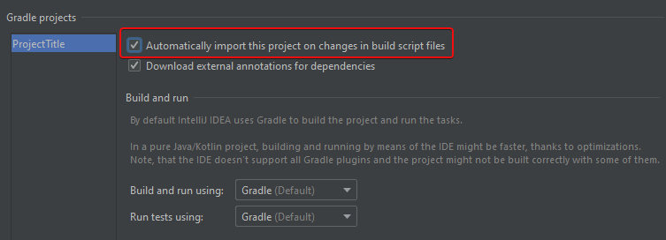
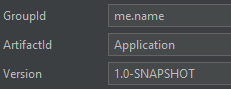

[Jetbrains]: https://jetbrains.com/
[download]: https://jetbrains.com/idea/

# IntelliJ IDEA setup
IntelliJ IDEA is an IDE for Java development made by [Jetbrains].  
You can download it [here][download].

!!! info "Notes"
    Replace `JDA_VERSION_HERE` with the listed version [here](../index.md).

## IntelliJ v2019
This is the setup when using IntelliJ v2019.x.x  
For setup with older versions see [here](#older-intellij-version)

1. Navigate to "New Project" (i.e. `File -> New -> Project...`)
2. Select Gradle on the left side and check "Java" under "Additional Libraries and Frameworks"  

3. Give your project a name. You can optionally also edit the location where it should be saved in.
    1. Make sure to click on "Artifact Coordinates" to expand it. There set a path for your groupId and optionally alter the version.
	
4. Click on "Finish" to create the project.
    1. You may get asked if you want to import dependencies. You can choose there to enable auto-import, but this can also be done in your settings.  
	  
	
    2. If you use a different Runner for your project can you also change this in the settings.
5. Let IntelliJ index the project.
6. Open the `build.gradle` file and populate it with the following content.  
```groovy
plugins {
    id'application'
    id'com.github.johnrengelman.shadow' version '4.0.4'
}

mainClassName = 'com.example.jda.Bot'

version '1.0'
def jdaVersion = 'JDA_VERSION_HERE'

sourceCompatibility = targetCompatibility = 1.8

repositories {
    jcenter()
}

dependencies {
    compile "net.dv8tion:JDA:$jdaVersion"
}

compileJava.options.encoding = 'UTF-8'
```
7. If IntelliJ didn't already do it, create a directory called `src/main/java`
8. Create the package of your bot. For example: `me.name.bot`
9. Create your first Class. For example: `Bot.java`
10. Configure the `mainClassName` in your `build.gradle` to point towards your class (`me.name.bot.Bot` in our case).
11. Setup your Bot. Example:  
	
12. To build your jar, use the `gradlew shadowJar` command. You can also run your project with the `run` gradle task.
13. Continue with [Getting started](../usage/index.md)

## Older IntelliJ version
This is for versions before v2019

1. Open the project view.
2. Click on "Create New Projecr" to start a new project.  

3. Select Gradle on the left side and check "Java" under "Additional Libraries and Frameworks".  

4. Click "Next" and fill out GroupId with your path (i.e. `me.name`) and ArtifactId with the name of your bot/application (i.e. `Bot`).  

5. Make sure to check "Use auto-import", click "Next" and then "Finish".  

6. You can now continue with step 5 for the [newer version of IntelliJ](#intellij-v2019)